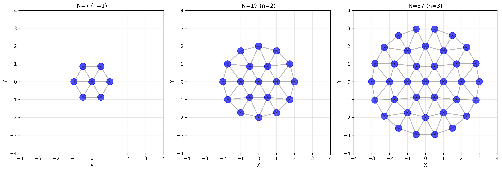
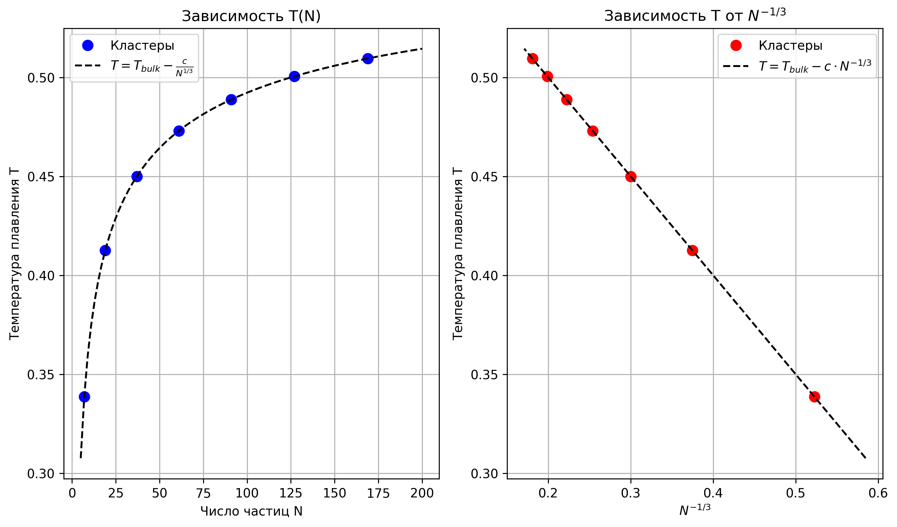
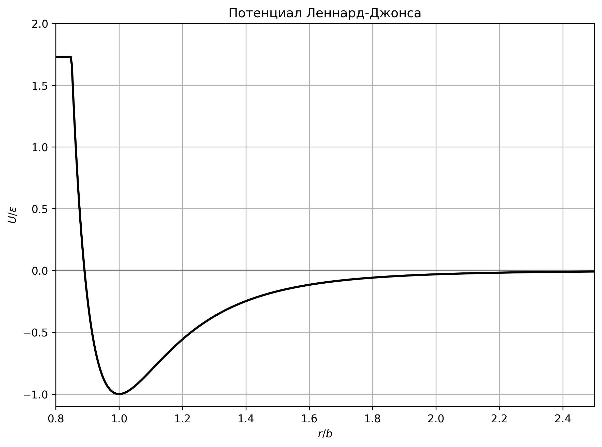
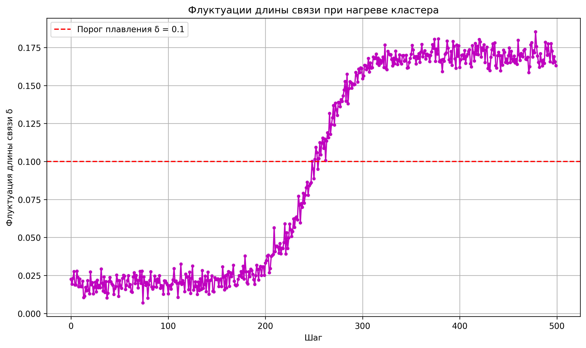
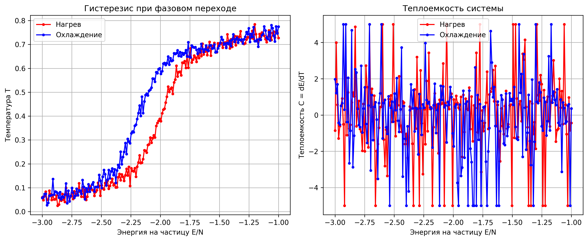

---
## Front matter
lang: ru-RU
title: Исследование плавления и затвердевания малых кластеров
subtitle: Отчет по первому этапу проекта
author:
  - Лихтенштейн Алина Алексеевна
institute:
  - Российский университет дружбы народов, Москва, Россия
date: 19 марта 2025

## i18n babel
babel-lang: russian
babel-otherlangs: english

## Formatting pdf
toc: false
toc-title: Содержание
slide_level: 2
aspectratio: 169
section-titles: true
theme: metropolis
header-includes:
 - \metroset{progressbar=frametitle,sectionpage=progressbar,numbering=fraction}
---

# Информация

## Докладчик

:::::::::::::: {.columns align=center}
::: {.column width="70%"}

  * Лихтенштейн Алина Алексеевна
  * Студент группы НФИбд-02-22
  * Российский университет дружбы народов
  * [1132229533@pfur.ru](1132229533@pfur.ru)

:::
::: {.column width="30%"}

<!--  -->

:::
::::::::::::::

# Вводная часть

## Актуальность

- Наноразмерные системы обладают уникальными свойствами, отличными от макроскопических тел
- Исследование фазовых переходов в малых кластерах важно для развития нанотехнологий
- Понимание зависимости свойств от размера частиц помогает создавать материалы с заданными характеристиками
- Компьютерное моделирование позволяет изучать процессы, трудно наблюдаемые экспериментально

## Объект и предмет исследования

- **Объект исследования**: малые кластеры с "магическими" числами частиц (7, 19, 37)
- **Предмет исследования**: процессы плавления и затвердевания в наноразмерных системах
- **Научная новизна**: выявление специфических эффектов фазовых переходов в зависимости от размера кластера
- **Практическая значимость**: применение результатов в разработке наноматериалов и наноустройств

## Цель и задачи

**Цель**: исследовать особенности плавления и затвердевания малых кластеров с "магическими" числами частиц.

**Задачи**:
- Изучить теоретические основы метода молекулярной динамики
- Рассмотреть особенности фазовых переходов в малых кластерах
- Разработать физическую модель для исследования плавления и затвердевания
- Определить необходимые параметры и алгоритмы для дальнейшего моделирования

## Материалы и методы

- **Метод молекулярной динамики** для моделирования движения частиц
- **Потенциал Леннард-Джонса** для описания взаимодействия между частицами
- **Алгоритм Верле** для численного интегрирования уравнений движения
- **Термодинамические характеристики**:
  - Температура
  - Флуктуации длины связи
  - Теплоемкость
  - Парная корреляционная функция

# Теоретические основы

## Особенности фазовых переходов в малых системах

В отличие от макроскопических систем, в малых кластерах:

- Температура плавления зависит от размера кластера
- Переход от твердого состояния к жидкому происходит в интервале температур
- Возможно оболочечное плавление (внешние слои плавятся раньше внутренних)
- Наблюдается квазиплавление (кластер проводит часть времени в твердом, часть в жидком состоянии)

## "Магические" числа и их значение

- "Магические" числа частиц соответствуют особо стабильным конфигурациям
- Для гексагональной структуры определяются формулой: $N = 1 + 3n(n+1)$
- Первые несколько "магических" чисел: 1, 7, 19, 37, 61
- У кластеров с "магическими" числами максимальна средняя энергия связи

:::::::::::::: {.columns align=center}
::: {.column width="90%"}

:::
::::::::::::::

## Зависимость температуры плавления от размера

- При уменьшении числа частиц снижается температура плавления $T_c$
- Это связано с увеличением доли поверхностных атомов, пропорциональной $N^{-1/3}$
- Поверхностные атомы имеют более высокую потенциальную энергию
- Экспериментально показано, что снижение $T_c$ может достигать сотен градусов

## Зависимость температуры плавления от размера

:::::::::::::: {.columns align=center}
::: {.column width="80%"}

:::
::::::::::::::

# Описание модели

## Потенциал взаимодействия

Для моделирования взаимодействия используется потенциал Леннард-Джонса:

$$U(r) = \varepsilon [(b/r)^{12} - 2(b/r)^{6}]$$

где:
- $\varepsilon$ — глубина потенциальной ямы
- $b$ — равновесное расстояние между частицами
- $r$ — расстояние между частицами

## Потенциал взаимодействия

:::::::::::::: {.columns align=center}
::: {.column width="50%"}

:::
::::::::::::::

## Алгоритм моделирования

Для интегрирования уравнений движения применяется алгоритм Верле в скоростной форме:

$$r_i^{n+1/2} = r_i^n + v_i^n \cdot \Delta t/2$$
$$r_i^{n+1} = r_i^n + v_i^{n+1/2} \cdot \Delta t$$
$$v_i^{n+1} = v_i^{n+1/2} + a_i^{n+1} \cdot \Delta t/2$$

**Критерий выбора шага**: сохранение полной энергии системы с точностью около 0.5%.

## Методика исследования

1. Создание кластера с "магическим" числом частиц при низкой температуре
2. Постепенный нагрев системы (масштабирование скоростей)
3. Уравновешивание системы после каждого шага нагрева
4. Усреднение термодинамических характеристик
5. Охлаждение системы для выявления гистерезиса
6. Анализ зависимости температуры плавления от размера кластера

# Ожидаемые результаты

## Идентификация фазовых переходов

Определение фазового перехода через:

- **Флуктуации длины связи**: резкое увеличение при плавлении
- **Теплоемкость**: пик соответствует фазовому переходу
- **Гистерезис** между кривыми нагрева и охлаждения

## Идентификация фазовых переходов

:::::::::::::: {.columns align=center}
::: {.column width="50%"}

:::
::::::::::::::

## Анализ гистерезиса

- Различие между процессами нагрева и охлаждения указывает на фазовый переход первого рода
- Величина гистерезиса зависит от размера кластера
- Ширина переходной области уменьшается с увеличением размера кластера

## Анализ гистерезиса

:::::::::::::: {.columns align=center}
::: {.column width="90%"}

:::
::::::::::::::

# Заключение

## Выводы

- Рассмотрены теоретические основы метода молекулярной динамики применительно к малым кластерам
- Описаны особенности фазовых переходов в наноразмерных системах
- Предложена физическая модель для исследования плавления и затвердевания
- Определены методы анализа фазового состояния системы

## Дальнейшие направления работы

- Программная реализация предложенной модели
- Проведение численных экспериментов для кластеров различных размеров
- Анализ зависимости температуры плавления от размера кластера
- Изучение явления оболочечного плавления и других специфических эффектов
