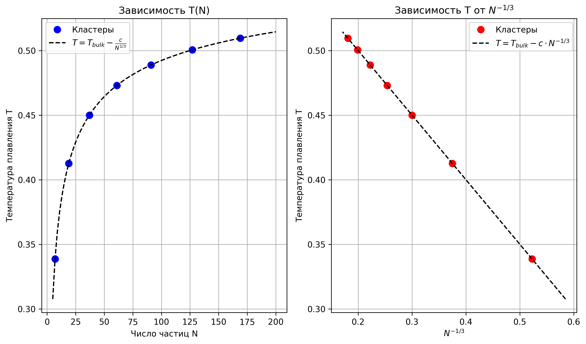
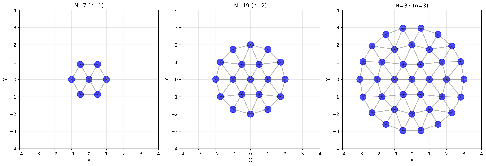
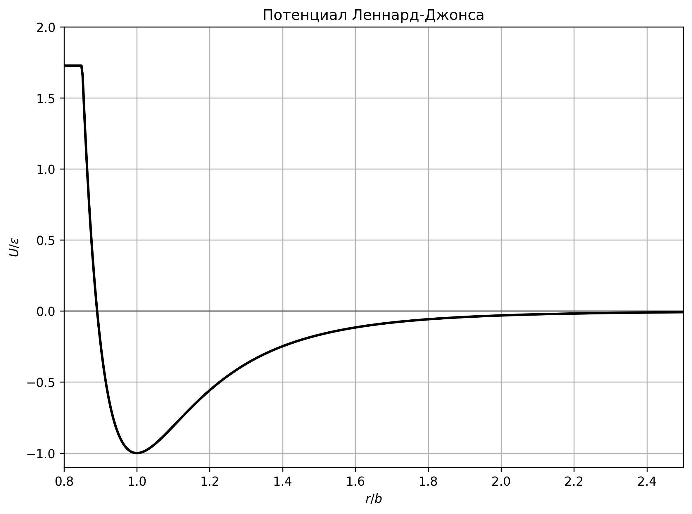
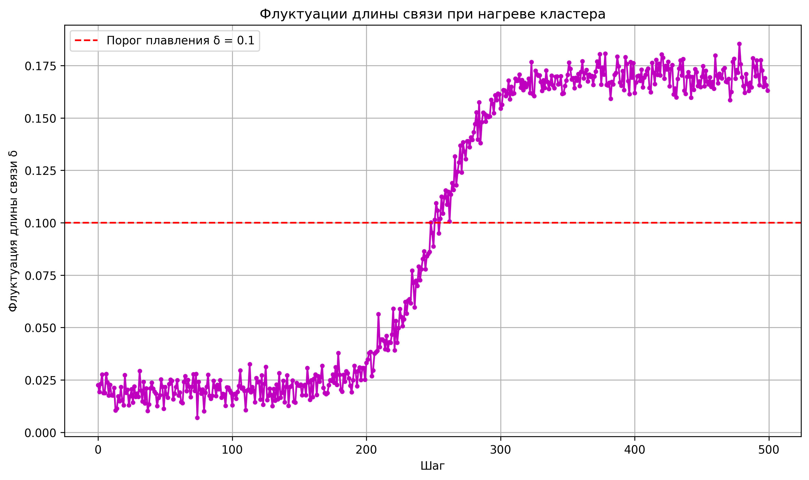
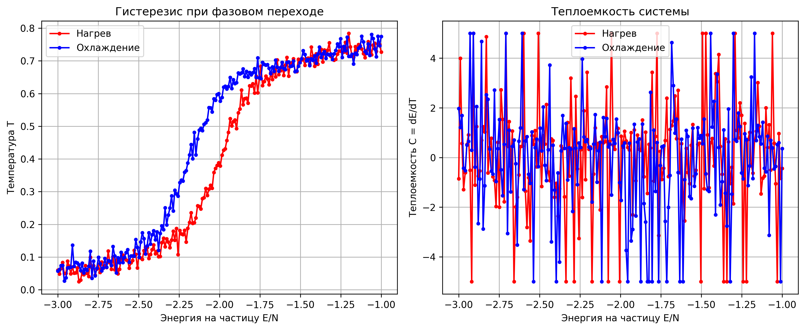

---
## Front matter
title: "Отчет по первому этапу проекта"
subtitle: "Исследование плавления и затвердевания малых кластеров"
author: "Лихтенштейн Алина Алексеевна"

## Generic otions
lang: ru-RU
toc-title: "Содержание"

## Bibliography
bibliography: bib/cite.bib
csl: pandoc/csl/gost-r-7-0-5-2008-numeric.csl

## Pdf output format
toc: true # Table of contents
toc-depth: 2
lof: true # List of figures
lot: true # List of tables
fontsize: 12pt
linestretch: 1.5
papersize: a4
documentclass: scrreprt
## I18n polyglossia
polyglossia-lang:
  name: russian
  options:
	- spelling=modern
	- babelshorthands=true
polyglossia-otherlangs:
  name: english
## I18n babel
babel-lang: russian
babel-otherlangs: english
## Fonts
mainfont: IBM Plex Serif
romanfont: IBM Plex Serif
sansfont: IBM Plex Sans
monofont: IBM Plex Mono
mathfont: STIX Two Math
mainfontoptions: Ligatures=Common,Ligatures=TeX,Scale=0.94
romanfontoptions: Ligatures=Common,Ligatures=TeX,Scale=0.94
sansfontoptions: Ligatures=Common,Ligatures=TeX,Scale=MatchLowercase,Scale=0.94
monofontoptions: Scale=MatchLowercase,Scale=0.94,FakeStretch=0.9
mathfontoptions:
## Biblatex
biblatex: true
biblio-style: "gost-numeric"
biblatexoptions:
  - parentracker=true
  - backend=biber
  - hyperref=auto
  - language=auto
  - autolang=other*
  - citestyle=gost-numeric
## Pandoc-crossref LaTeX customization
figureTitle: "Рис."
tableTitle: "Таблица"
listingTitle: "Листинг"
lofTitle: "Список иллюстраций"
lotTitle: "Список таблиц"
lolTitle: "Листинги"
## Misc options
indent: true
header-includes:
  - \usepackage{indentfirst}
  - \usepackage{float} # keep figures where there are in the text
  - \floatplacement{figure}{H} # keep figures where there are in the text
---

# Цель работы

Целью данного этапа является изучение теоретических основ метода молекулярной динамики и построение модели для исследования процессов плавления и затвердевания малых кластеров с "магическими" числами частиц.

# Задание

1. Изучить теоретические основы метода молекулярной динамики
2. Рассмотреть особенности фазовых переходов в малых кластерах
3. Разработать физическую модель для исследования плавления и затвердевания малых кластеров с "магическими" числами частиц (7, 19, 37)
4. Определить необходимые параметры и алгоритмы для дальнейшего моделирования

# Теоретическое введение

## Молекулярная динамика как метод моделирования

Метод молекулярной динамики (МД) рассматривает поведение вещества на микроуровне, позволяя наблюдать за движением отдельных молекул. Несмотря на то, что макроскопические тела содержат слишком много молекул для полного моделирования, применение метода МД даже к "небольшим" системам из нескольких сотен или тысяч частиц позволяет понять наблюдаемые свойства газов, жидкостей и твердых тел.

Особый интерес представляют малые системы (наночастицы), которые обладают уникальными свойствами, отличными от объемных материалов. Изучение таких систем имеет как фундаментальное, так и прикладное значение для развития нанотехнологий.

## Фазовые переходы в малых частицах

В отличие от макроскопических систем, где фазовые переходы происходят при строго определенной температуре, в малых системах наблюдаются специфические особенности:

1. Температура плавления зависит от размера кластера
2. Переход от твердого состояния к жидкому происходит не скачком, а в некотором интервале температур
3. Возможно оболочечное плавление, когда внешние слои плавятся при более низкой температуре, чем внутренние
4. Наблюдается явление квазиплавления, когда кластер проводит часть времени в твердом состоянии, а часть — в жидком

При уменьшении числа частиц в кластере происходит снижение температуры плавления $T_c$. Это обусловлено увеличением доли частиц, расположенных на поверхности, которая пропорциональна $N^{-1/3}$. Поверхностные атомы имеют более высокую потенциальную энергию, поэтому средняя потенциальная энергия на одну частицу растет с уменьшением N, что приводит к понижению $T_c$. Экспериментально показано, что уменьшение температуры плавления может достигать сотен градусов.

{#fig:001 width=70%}

Для малых кластеров характерно наличие "магических" чисел частиц, при которых структура кластера обладает особой стабильностью. В случае гексагональной структуры "магические" числа определяются формулой:

$$N = 1 + 3n(n+1)$$

где n — число оболочек. Первые несколько "магических" чисел: 1, 7, 19, 37, 61.

{#fig:002 width=70%}

## Уравнения молекулярной динамики

Несмотря на то, что микрочастицы являются квантовыми объектами, во многих практически интересных случаях возможно рассматривать их классически. Движение частиц описывается вторым законом Ньютона:

$$m_i\frac{d^2\vec{r}_i}{dt^2} = \vec{F}_i$$

где $\vec{F}_i = -\frac{\partial E_p}{\partial \vec{r}_i}$ — сила, действующая на частицу.

Система из N частиц описывается N обыкновенными дифференциальными уравнениями второго порядка, которые можно переписать в виде 2N уравнений первого порядка:

$$\frac{d\vec{r}_i}{dt} = \vec{v}_i$$
$$\frac{d\vec{v}_i}{dt} = \vec{a}_i$$

где $\vec{a}_i = \frac{\vec{F}_i}{m_i}$ — ускорение частицы.

## Потенциал Леннард-Джонса

Для моделирования взаимодействия между частицами широко используется потенциал Леннард-Джонса:

$$U_{LJ}(r) = \varepsilon\left[\left(\frac{b}{r}\right)^{12} - 2\left(\frac{b}{r}\right)^6\right]$$

где $\varepsilon$ — глубина потенциальной ямы, b — равновесное расстояние между частицами.

Этот потенциал хорошо описывает взаимодействие инертных газов и может служить качественной моделью для других веществ. Его достоинством является короткодействующий характер — сила взаимодействия быстро спадает с увеличением расстояния. Практически при расстояниях $r > r_c$ взаимодействие можно не учитывать, где $r_c$ — радиус обрезания, обычно принимаемый $r_c \geq 2.5b$.

{#fig:003 width=70%}

# Описание модели

## Алгоритм моделирования

Для численного решения уравнений движения частиц используется алгоритм Верле в скоростной форме, обладающий третьим порядком точности при постоянном шаге по времени:

$$\vec{r}_i^{n+1/2} = \vec{r}_i^n + \vec{v}_i^n \cdot \frac{\Delta t}{2}$$
$$\vec{r}_i^{n+1} = \vec{r}_i^n + \vec{v}_i^{n+1/2} \cdot \Delta t$$
$$\vec{v}_i^{n+1} = \vec{v}_i^{n+1/2} + \vec{a}_i^{n+1} \cdot \frac{\Delta t}{2}$$

Критерием для выбора шага по времени является условие сохранения полной энергии системы с точностью около 0.5%.

## Начальные и граничные условия

Для моделирования малых кластеров используется следующий подход:

1. Начальная конфигурация представляет собой гексагональную структуру с "магическим" числом частиц
2. Начальные скорости генерируются с помощью распределения Максвелла для низкой температуры
3. Суммарный импульс системы устанавливается равным нулю
4. Для изолированных кластеров также устанавливается нулевой полный момент импульса

## Термодинамические характеристики

Для анализа фазового состояния системы используются следующие параметры:

1. Температура, вычисляемая как:
   
   $$T = \frac{2}{(2N-3)k} \sum_i \frac{m_i(\vec{v}_i-\vec{v}_{cm})^2}{2}$$
   
   где $\vec{v}_{cm}$ — скорость центра масс кластера, k — постоянная Больцмана.

2. Среднеквадратичная флуктуация длины связи:
   
   $$\delta = \sqrt{\frac{2}{N(N-1)} \sum_{i<j} \frac{\langle r_{ij}^2 \rangle - \langle r_{ij} \rangle^2}{\langle r_{ij} \rangle}}$$
   
   При начале фазового перехода величина δ начинает быстро возрастать.

{#fig:004 width=70%}

3. Теплоемкость системы, определяемая как производная энергии по температуре:
   
   $$C = \frac{dE}{dT}$$
   
   Пик теплоемкости соответствует фазовому переходу.

4. Парная корреляционная функция g(r), позволяющая различать различные фазовые состояния.

## Методика исследования плавления и затвердевания

Для исследования процессов плавления и затвердевания кластеров применяется следующая методика:

1. Кластер с "магическим" числом частиц (7, 19, 37) уравновешивается при низкой температуре
2. Проводится постепенный нагрев системы путем масштабирования скоростей частиц
3. На каждом шаге нагрева система приводится к равновесию, после чего вычисляются и усредняются термодинамические характеристики
4. После достижения жидкого состояния проводится обратный процесс — охлаждение
5. Анализируются различия между кривыми нагрева и охлаждения для выявления гистерезиса
6. Определяется зависимость температуры плавления от размера кластера

{#fig:005 width=70%}

# Выводы

В данном отчете рассмотрены теоретические основы метода молекулярной динамики применительно к исследованию фазовых переходов в малых кластерах. Особое внимание уделено особенностям плавления и затвердевания наноразмерных систем с "магическими" числами частиц.

Предложена физическая модель для исследования, включающая:
- Потенциал взаимодействия Леннард-Джонса
- Алгоритм Верле для численного интегрирования уравнений движения
- Методику определения фазового состояния через анализ теплоемкости и флуктуаций длины связи

Дальнейшее развитие проекта будет направлено на программную реализацию модели и проведение численных экспериментов для кластеров различных размеров.

# Список литературы{.unnumbered}

Медведев Д. А. - Моделирование физических процессов и явлений на ПК
